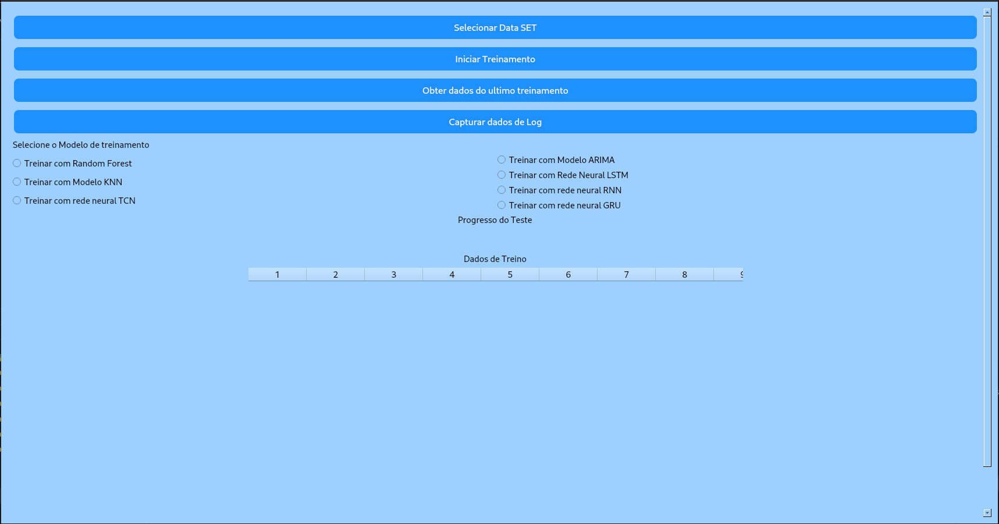
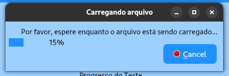
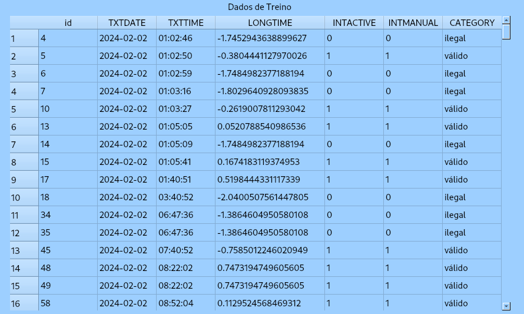
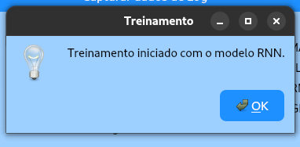
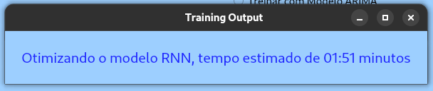
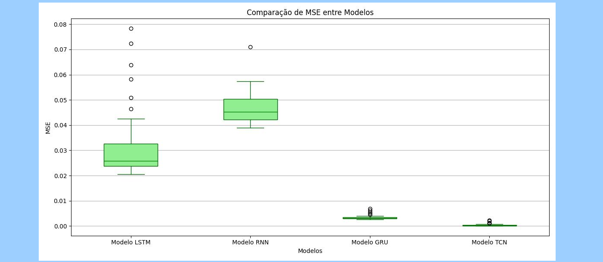
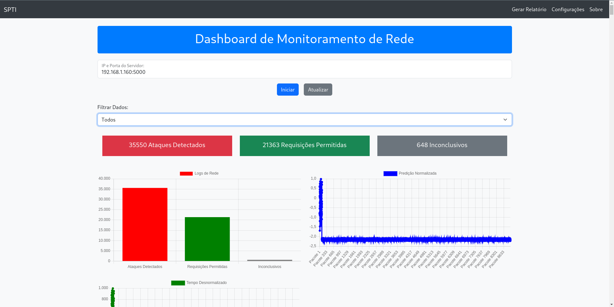
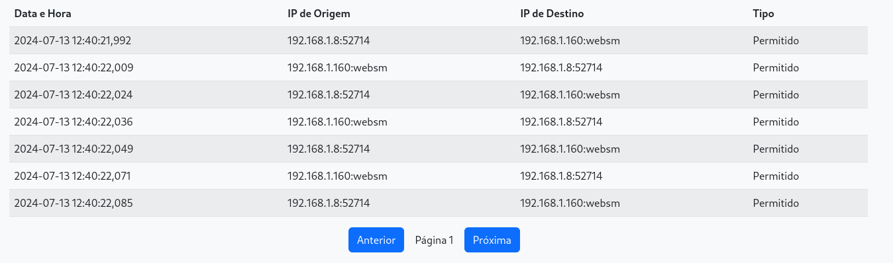
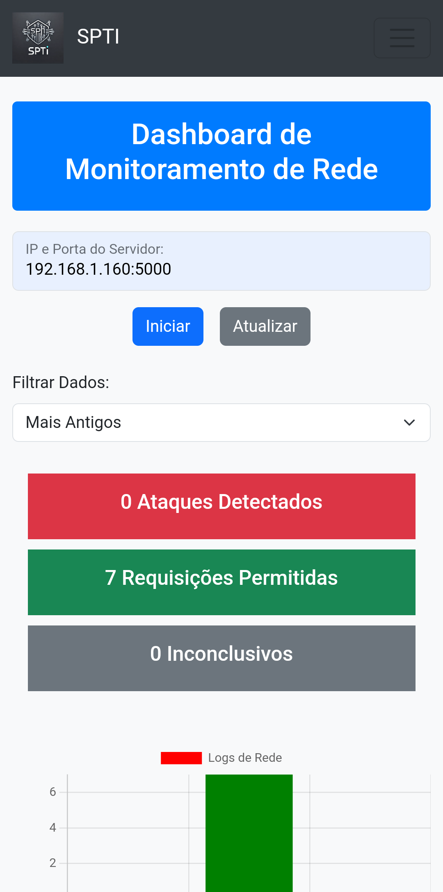
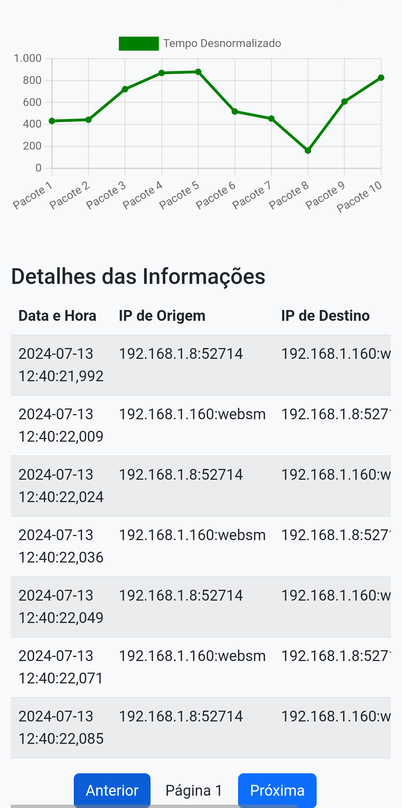

# Documentação da Ferramenta SPTI

---

### 1. **Introdução**

- **Nome da ferramenta**: Sistema de Previsão Temporal Inteligente (SPTI)
- **Descrição geral**: A SPTI é uma solução para detectar e tratar incidentes de segurança em redes, com foco em ataques de botnet e outras ameaças cibernéticas. Utilizando redes neurais, como **TCN (Temporal Convolutional Network)**, a ferramenta analisa pacotes de rede para identificar atividades maliciosas. A SPTI inclui uma API REST para integração com outras soluções e uma interface gráfica desenvolvida em **PyQt5**. Além disso, conta com um **dashboard web** para monitoramento e visualização em tempo real.

---

<div style="text-align: center;">
    
</div>

### 2. **Requisitos do Sistema**

- **Sistema Operacional**: Linux, Windows, macOS
- **Dependências**:
  - **Python 3.x**
  - **Bibliotecas Python**:
    - `PyQt5`: Interface gráfica.
    - `TensorFlow/Keras`: Para o modelo TCN.
    - `Pandas`, `NumPy`: Manipulação e análise de dados.
    - `Scikit-learn`: Normalização e processamento de dados.
    - **Frameworks Web**:
      - `Flask` ou `FastAPI` para a API REST.
      - `HTML`, `CSS`, `JavaScript` para o desenvolvimento da parte web.
    - **Outras dependências**:
      - Docker (opcional) para isolar e facilitar a instalação.

---

### 3. **Instalação**

- **Passo 1**: Clone o repositório do projeto:

  ```bash
  git clone https://github.com/usuario/spti.git
  cd spti
  ```
- **Passo 2**: Instale as dependências:

  ```bash
  pip install -r requirements.txt
  ```
- **Passo 3**: (Opcional) Utilize Docker para configurar o ambiente rapidamente:

  - **Dockerfile**: O projeto inclui um `Dockerfile` que pode ser utilizado para construir e rodar a aplicação em um contêiner.

  ```bash
  docker build -t spti .
  docker run -p 5000:5000 spti
  ```

---

### 4. **Execução da API**

- **Passo 1**: Execute o arquivo da API:
  ```bash
  python app.py
  ```
- **Passo 2**: O sistema abrirá um endpoint em `http://localhost:5000`, permitindo o envio de pacotes de rede para detecção de ataques.
- **Exemplo de Endpoint**:
  - **POST /predict**
    - Enviar pacotes para o endpoint `/predict` para análise:
      ```bash
      curl -X POST http://localhost:5000/predict -H "Content-Type: application/json" -d '{"features": [dados_do_pacote]}'
      ```
  - **Resposta**:
    ```json
    {
      "prediction": [valor_da_predição],
      "status": "Ataque" ou "Permitido"
    }
    ```

---

### 5. **Interface Gráfica (Python Qt5)**

- **Descrição**: A interface gráfica desenvolvida em PyQt5 no SPTI tem como principal objetivo facilitar o processo de treinamento dos modelos utilizados na API. Ela oferece uma série de funcionalidades intuitivas, como botões que permitem ao usuário carregar conjuntos de dados, iniciar o treinamento dos modelos, visualizar métricas de desempenho de treinamentos anteriores e monitorar dados de logs de maneira interativa. Essa interface foi implementada como uma funcionalidade adicional, visando simplificar a experiência do usuário e otimizar o processo de ajuste dos modelos.
- **Principais Funcionalidades**:

  - Exibição de uma barra de progresso que exibe o estado atual treinamento do modelo escolhido
  - Exibe uma planilha com as informações do data set processado.
  - Exibe pop-up para os usuário onde é informado o tempo de otimização do modelo e o progresso de carregamento do data set.
  - Ao final do treinamento são exibidos gráficos de métricas e gráficos que comparam os valores reais e previstos pelo modelo.
- **Execução**:

  ```bash
  python main.py
  ```

  #### Imagens do SPTI (PyQt5)

  
- Figura 1: Interfaçe inicial do SPTI. Fonte: Dos autores

  
- Figura 2: Barra de progresso do carregamento do data set. Fonte: Dos autores

  
- Figura 3: Planinha do Data set. Fonte: Dos autores

  
- Figura 4: Confirmação do Modelo escolhido. Fonte: Dos autores

  
- Figura 5: Tempo estimado de otimização do modelo. Fonte: Dos autores

  
- Figura 6: Progresso do teste. Fonte: Dos autores

  
- Figura 7: Gráfico gerado pós treinamento. Fonte: Dos autores

---

### 6. Processo de Trenamento dos modelos no SPTI

Todos os modelos utilizados no SPTI seguem um fluxo padronizado para treinamento e avaliação, garantindo consistência e eficiência no processo de implementação. A estrutura segue as seguintes etapas:

1. **Pré-processamento dos Dados**: Antes de qualquer treinamento, os dados passam por um pipeline de pré-processamento. Isso inclui transformações como normalização, preenchimento de valores ausentes e engenharia de características, com a adição de médias móveis, desvios padrão e features de "lag".
2. **Divisão de Dados**: O conjunto de dados é dividido em treinamento e teste (geralmente com uma proporção de 80/20), mantendo uma parte dos dados para validação do desempenho do modelo após o treinamento.
3. **Ajuste de Hiperparâmetros**: O ajuste dos hiperparâmetros é feito de forma automatizada utilizando técnicas como o **RandomizedSearchCV**, explorando diferentes combinações de parâmetros para encontrar a melhor configuração do modelo.
4. **Treinamento Incremental**: O modelo é treinado de maneira incremental, ajustando os pesos em cada época. Durante esse processo, métricas como o erro quadrático médio (MSE) e a raiz do erro quadrático médio (RMSE) são monitoradas para avaliar o progresso do modelo.
5. **Avaliação e Métricas**: Após o treinamento, o modelo é avaliado no conjunto de teste, e métricas como o MSE, RMSE e o coeficiente de determinação (R²) são calculados para quantificar o desempenho. Esses resultados são posteriormente visualizados por meio de gráficos, que incluem também comparações entre valores reais e previstos.
6. **Data Augmentation**: Para melhorar o desempenho e a generalização do modelo, o SPTI utiliza técnicas de "data augmentation", introduzindo pequenas variações nos dados de treinamento através de ruído aleatório. Isso aumenta a robustez do modelo.
7. **Relatório e Armazenamento de Modelos**: Após o treinamento, o modelo é salvo em um diretório dedicado, juntamente com um relatório detalhado gerado automaticamente. Esse relatório inclui tanto as métricas obtidas quanto visualizações e um sumário do modelo.

Essa padronização não só facilita a manutenção do SPTI, como também permite a adição de novos modelos de forma eficiente, utilizando a mesma infraestrutura de treinamento e avaliação.

### 7. **Parte Web do SPTI**

- **Descrição**: O **dashboard web** do SPTI foi desenvolvido utilizando as tecnologias **HTML**, **CSS** e **JavaScript**, em conjunto com o **Flask**  para a comunicação entre o front-end e o back-end. A interface web permite monitorar as requisições e predições em tempo real, com gráficos e tabelas interativas para uma visão completa do status da rede.
- **Estrutura**:

  - **HTML**: A estrutura básica do dashboard é montada em HTML, com elementos que incluem gráficos, tabelas de requisições e botões de controle.
  - **CSS**: Responsável pelo design e layout da página, garantindo que os componentes sejam apresentados de maneira clara e organizada.
  - **JavaScript**: Utilizado para manipular os dados em tempo real, atualizando os gráficos e a tabela de requisições conforme os pacotes são processados.
  - **API**: A comunicação entre o front-end (dashboard web) e o back-end (modelo de predição) é feita por meio de chamadas à API REST, que retorna os resultados da análise de pacotes.
- **Funcionalidades**:

  - **Exibição em tempo real**: O dashboard exibe gráficos que mostram as predições de pacotes de rede em tempo real, classificando-os como "Ataque" ou "Permitido".
  - **Tabela de requisições**: Mostra os detalhes de cada requisição, incluindo o IP de origem e destino, data/hora e status de segurança.
  - **Gráficos interativos**: O gráfico de predições é atualizado dinamicamente, fornecendo uma visão clara das tendências e anomalias detectadas pelo modelo.
- **Arquitetura do Front-End**:

  - **HTML** (em `templates/`): Define a estrutura da página.
  - **CSS** (em `static/css/`): Controla o estilo e layout do dashboard.
  - **JavaScript** (em `static/js/`): Atualiza os dados em tempo real, conecta-se à API e renderiza os gráficos.
  - **Flask/FastAPI**: Serve o conteúdo da aplicação e fornece os dados necessários para o front-end.
- **Como Executar**:

  ```bash
  python run_web.py
  ```

  - **Acesso**: Após rodar o comando, abra um navegador e acesse `http://localhost:5000` para visualizar o dashboard.

  #### Imagens do Dashboard web

  
- Painel de monitoramento do SPTI. Fonte: Dos autores.

  
- Planilha com informações detalhada dos pacotes: Fonte dos Autores

  
- Dashboard acessado pelo Celular: Fonte dos Autores

  
- Planilha vista pelo Celuar Fonte dos Autores

---

### 8. **Exemplo de Execução Completa**

- **Passo 1**: Execute o script principal da API e a interface web:
  ```bash
  python start_app.py
  ```
- **Passo 2**: Acesse o **dashboard** da ferramenta através de `http://localhost:5000`.
  - O dashboard exibirá as predições do modelo e as requisições de pacotes sendo atualizadas em tempo real.
  - Os gráficos mostram os resultados das predições e se os pacotes foram classificados como "Ataque" ou "Permitido".

---

### 9. **Testes e Exemplos de Uso**

- **Exemplo de Teste Mínimo**:
  - Enviar um pacote de rede malicioso pela API e verificar o resultado no dashboard web. A API deverá identificar a atividade como um **ataque** e exibir a informação no gráfico e na tabela de requisições.
- **Testes com múltiplos cenários**:
  - Teste o sistema enviando pacotes de diferentes tipos de ataque, como **DoS**, **injeção de comandos** ou **ataques de replay**, e veja o comportamento do modelo no dashboard web.

---

### 10. **Contribuição e Suporte**

- **Como contribuir**:
  - Para contribuir com o desenvolvimento da SPTI:
    - Faça um **fork** do projeto.
    - Crie uma nova **branch** para as suas alterações.
    - Envie um **pull request** com a descrição detalhada das modificações.
- **Suporte**:
  - Em caso de dúvidas ou problemas, consulte a seção de **issues** no repositório ou entre em contato com os desenvolvedores.

---

### 11. **Futuras Melhorias**

- **Otimizações no Modelo**: Melhorar a precisão do modelo TCN ou explorar outros algoritmos de machine learning.
- **Dashboard aprimorado**: Adicionar mais funcionalidades ao dashboard web, como filtros avançados e relatórios exportáveis.
- **Integração com Ferramentas de Segurança**: Expansão da API para se integrar com sistemas como **Wazuh**, aumentando as capacidades de monitoramento e resposta a incidentes.

---
