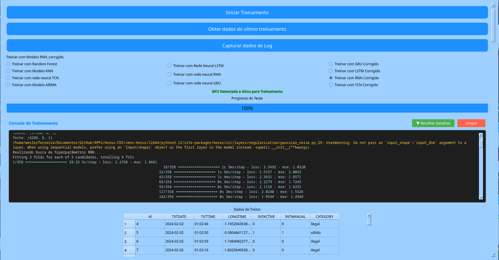
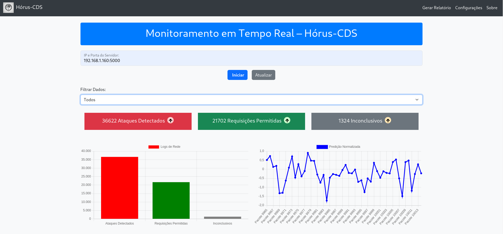
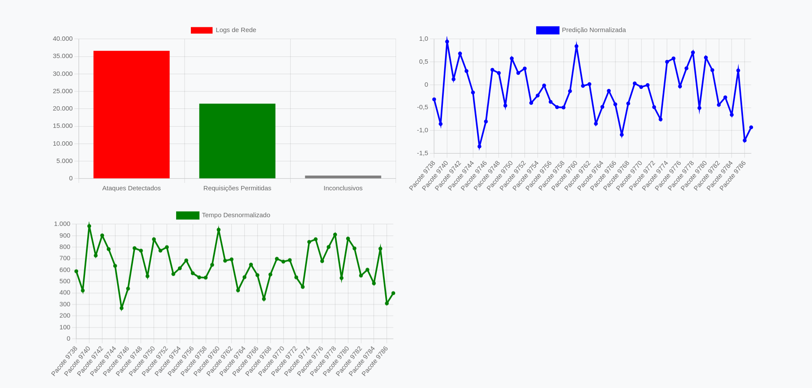
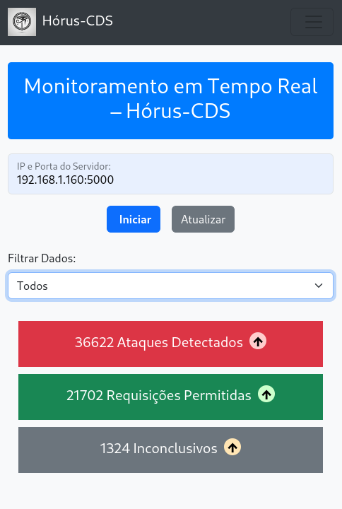
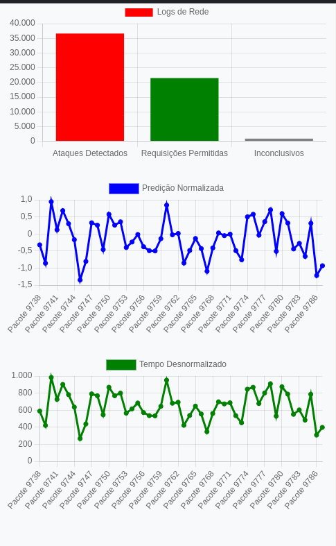

# Hórus-Cyber Detection for Smart Grids (Hórus-CDS)

## Resumo

O Hórus-CDS é uma ferramenta para detecção e monitoramento de incidentes de segurança em redes elétricas inteligentes, com foco na identificação de ataques cibernéticos, como ataques distribuídos de negação de serviço (DDoS). A solução utiliza redes neurais do tipo **Temporal Convolutional Networks (TCN)** para identificar padrões anômalos nos logs de acesso dos **smart grids**. Além do TCN, outros modelos de aprendizado de máquina foram testados para comparação de desempenho em termos de precisão e recall. O Hórus-CDS também conta com duas interfaces: uma para o treinamento dos modelos e outra para monitoramento da segurança em tempo real.

<div style="text-align: center;">
    
</div>

## Selos Considerados

Os selos considerados para o Hórus-CDS são:

* **Disponíveis (SeloD)**: O código-fonte e os modelos treinados estão acessíveis publicamente.
* **Funcionais (SeloF)**: A ferramenta pode ser executada conforme documentado.
* **Experimentos Reprodutíveis (SeloR)**: Os experimentos podem ser replicados seguindo as instruções fornecidas

## Documentação

Este repositório contém documentação completa para instalação e uso do sistema:

### Guias de Início Rápido
* **[QUICKSTART.md](QUICKSTART.md)** - Guia rápido de instalação e primeiros passos (recomendado para iniciantes)

### Documentação Principal
* **[README.md](README.md)** - Documentação principal do projeto com instalação e experimentos
* **[CUDA_INSTALLATION.md](CUDA_INSTALLATION.md)** - Guia completo de instalação CUDA e cuDNN para aceleração GPU (20KB)
* **[DOCKER.md](DOCKER.md)** - Guia de deployment com Docker e Docker Compose incluindo suporte GPU (8KB)
* **[root/API/README_API.md](root/API/README_API.md)** - Documentação específica da API REST

### Ferramentas e Configuração
* **[install.sh](install.sh)** - Script de instalação automática para Linux/macOS (interativo)
* **[install.bat](install.bat)** - Script de instalação automática para Windows (interativo)
* **[test_gpu_setup.py](test_gpu_setup.py)** - Script de validação automática da configuração GPU/CUDA
* **[docker-compose.yml](docker-compose.yml)** - Configuração Docker padrão (CPU-only)
* **[docker-compose-gpu.yml](docker-compose-gpu.yml)** - Configuração Docker com suporte GPU

### Documentação Complementar
* **[CHANGELOG_CUDA.md](CHANGELOG_CUDA.md)** - Registro detalhado das adições de documentação CUDA
* **[SUMMARY_CUDA_DOCS.md](SUMMARY_CUDA_DOCS.md)** - Sumário executivo da documentação GPU/CUDA

## **Estrutura do Repositório**

* **`root/Linux/`** - Contém os scripts para a execução da interface PyQt5.
* **`root/web/`** - Contém os arquivos do dashboard web.
* **`root/API/models/`** - Modelos de aprendizado de máquina pré-treinados.
* **`root/API/logs/`** - Arquivos de logs gerados durante a execução do sistema.
* **`root/API/`** - Código do servidor backend (Flask).
* **`root/web/static/`** - Arquivos CSS, JS e imagens do dashboard web.
* **`root/web/templates/`** - Contém os index.html onde está a estrutura principal da interface web.

## **Requisitos do Sistema**

### Requisitos de Hardware:

* **Processador**: Intel Core i5 ou superior (ou AMD Ryzen 5)
* **Memória RAM**: 8GB mínimo (16GB recomendado)
* **Espaço em disco**: 10GB livres
* **GPU (Opcional)**: NVIDIA GPU com suporte CUDA para aceleração de treinamento
  - Exemplos: GeForce RTX série 20xx/30xx/40xx, GTX série 16xx, Tesla, Quadro
  - Compute Capability 3.5 ou superior
  - 4GB de VRAM mínimo (6GB ou mais recomendado)

### Requisitos de Software:

* **Sistema Operacional**: 
  - Linux: Ubuntu 22.04/24.04, Fedora 38/39/40 (recomendado para GPU)
  - Windows: 10 (versão 1909+) ou 11
  - macOS: 10.13+ (suporte GPU limitado)
* **Python**: 3.12 (testado com 3.12.12)
* **CUDA Toolkit**: 12.3+ (12.6 recomendado) - apenas para GPU
* **cuDNN**: 9.0+ (9.5.1 recomendado) - apenas para GPU
* **Docker**: 20.10+ e Docker Compose 2.0+ (opcional, para deployment)
* **Frameworks**: Flask para API REST e dashboard web

## Dependências

Para a execução da ferramenta, as seguintes dependências devem ser instaladas:

```
pip install -r requirements.txt
```

Principais bibliotecas utilizadas:

* `PyQt5`: Interface gráfica
* `TensorFlow/Keras`: Modelos de aprendizado de máquina
* `Pandas`, `NumPy`: Manipulação de dados
* `Scikit-learn`: Normalização e processamento
* `Matplotlib`, `Seaborn`: Visualização de dados

### Aceleração GPU (Opcional)

Para utilizar aceleração por GPU durante o treinamento dos modelos, é necessário instalar os drivers NVIDIA CUDA e cuDNN. O sistema foi testado com CUDA 12.6 e cuDNN 9.5.1.

Consulte o guia completo de instalação: [CUDA_INSTALLATION.md](CUDA_INSTALLATION.md)

**Requisitos mínimos**:
* GPU NVIDIA com Compute Capability 3.5 ou superior
* Driver NVIDIA 525.60.13 ou superior
* CUDA Toolkit 12.3 ou superior
* cuDNN 9.0 ou superior

**Nota**: A aceleração GPU não é obrigatória. O sistema pode ser executado utilizando apenas CPU, porém com maior tempo de treinamento.

## Preocupações com Segurança

A execução da ferramenta não apresenta riscos significativos, porém:

* É recomendável rodar os experimentos em ambiente isolado.
* Não executar o código em redes de produção sem testes prévios.

### 3. **Instalação**

O Horus-CDS pode ser instalado de três formas diferentes, dependendo das necessidades e preferências do ambiente de desenvolvimento ou produção.

#### Instalação Rápida (Recomendado)

Para instalação guiada com interface interativa, utilize os scripts de instalação automática:

**Linux / macOS**:
```bash
git clone https://github.com/wesleiferreira98/Horus-CDS.git
cd Horus-CDS
./install.sh
```

**Windows**:
```cmd
git clone https://github.com/wesleiferreira98/Horus-CDS.git
cd Horus-CDS
install.bat
```

O instalador apresentará três opções:
1. Instalação Global (sem venv, sem Docker) - Não recomendado
2. Instalação com Ambiente Virtual (venv-Horus) - **Recomendado**
3. Instalação com Docker - Recomendado para produção

O script verifica automaticamente as dependências, detecta GPU NVIDIA (se disponível) e configura o ambiente apropriado.

---

#### Instalação Manual

Se preferir instalação manual, siga as instruções abaixo:

#### 3.1. Instalação com Ambiente Virtual Python (venv)

Esta é a forma recomendada para desenvolvimento local.

**Passo 1**: Clone o repositório do projeto:

```bash
git clone https://github.com/wesleiferreira98/Horus-CDS.git
cd Horus-CDS
```

**Passo 2**: Crie e ative o ambiente virtual:

```bash
# Criar ambiente virtual
python3.12 -m venv venv-Horus

# Ativar ambiente virtual (Linux/macOS)
source venv-Horus/bin/activate

# Ativar ambiente virtual (Windows)
venv-Horus\Scripts\activate
```

**Passo 3**: Instale as dependências:

```bash
pip install --upgrade pip
pip install -r requirements.txt
```

**Passo 4**: Verifique a instalação:

```bash
python --version  # Deve exibir Python 3.12.x
pip list  # Lista todas as dependências instaladas
```

#### 3.2. Instalação Tradicional (Sistema Global)

Para instalação direta no sistema, sem ambiente virtual.

**Passo 1**: Clone o repositório:

```bash
git clone https://github.com/wesleiferreira98/Horus-CDS.git
cd Horus-CDS
```

**Passo 2**: Instale as dependências globalmente:

```bash
pip install --upgrade pip
pip install -r requirements.txt
```

**Nota**: Esta abordagem não é recomendada pois pode causar conflitos com outras instalações Python no sistema.

#### 3.3. Instalação com Docker (Recomendado para Produção)

Docker oferece isolamento completo e facilita o deployment em diferentes ambientes.

**Pré-requisitos**:

- Docker Engine 20.10 ou superior
- Docker Compose 2.0 ou superior
- NVIDIA Container Toolkit (apenas para uso com GPU)

**Nota sobre GPU**: Para utilizar GPU dentro de containers Docker, é necessário instalar o NVIDIA Container Toolkit. Consulte a documentação completa em [CUDA_INSTALLATION.md](CUDA_INSTALLATION.md) e [DOCKER.md](DOCKER.md).

**Passo 1**: Clone o repositório:

```bash
git clone https://github.com/wesleiferreira98/Horus-CDS.git
cd Horus-CDS
```

**Passo 2**: Escolha o arquivo de configuração apropriado:

```bash
# Para execução CPU-only (padrão)
docker-compose build
docker-compose up -d

# Para execução com GPU (requer NVIDIA Container Toolkit)
docker-compose -f docker-compose-gpu.yml build
docker-compose -f docker-compose-gpu.yml up -d
```

**Nota**: O arquivo `docker-compose-gpu.yml` está pré-configurado com suporte GPU. Consulte [DOCKER.md](DOCKER.md) para detalhes sobre configuração GPU.

**Passo 3**: Verifique o status dos containers:

```bash
docker-compose ps

# Ou para versão GPU
docker-compose -f docker-compose-gpu.yml ps
```

**Passo 4**: Visualize os logs (opcional):

```bash
# Logs da API
docker-compose logs -f horus-api

# Logs da interface web
docker-compose logs -f horus-web

# Para versão GPU, substitua por docker-compose-gpu.yml
```

**Passo 5**: Parar os containers:

```bash
docker-compose down
```

**Comandos úteis do Docker**:

```bash
# Reconstruir após mudanças no código
docker-compose up -d --build

# Acessar shell dentro do container
docker exec -it horus-cds-api bash

# Remover containers, redes e volumes
docker-compose down -v
```

#### 3.4. Verificação da Instalação

Independentemente do método escolhido, verifique se a instalação foi bem-sucedida:

**Verificação Rápida (venv ou tradicional)**:

```bash
python -c "import tensorflow; print(tensorflow.__version__)"
python -c "import PyQt5; print('PyQt5 instalado com sucesso')"
```

**Verificação Completa com GPU (recomendado)**:

Execute o script de teste completo que verifica Python, TensorFlow, CUDA, GPU e todas as bibliotecas:

```bash
python test_gpu_setup.py
```

Este script irá:
- Verificar versão do Python
- Testar instalação do TensorFlow
- Detectar suporte CUDA
- Listar dispositivos GPU disponíveis
- Executar benchmark de performance CPU vs GPU
- Verificar todas as bibliotecas necessárias

**Para instalação com Docker**:

```bash
docker exec horus-cds-api python -c "import tensorflow; print(tensorflow.__version__)"
docker exec horus-cds-api python test_gpu_setup.py
```

### Teste Minimo

Para verificar a execução correta da ferramenta, faça somente após executar o **experimento 1**:

```
curl -X POST http://localhost:5000/predict -H "Content-Type: application/json" \
     -d '{"features": [[[244], [570], [243], [226], [607], [705], [243], [741]]]}'
```

A resposta esperada será:

```
{
  "prediction": [valor_da_predição],
  "status": "Ataque" ou "Permitido"
}
```

---

# Experimentos

### Experimento 1. **Execução da API**

#### 1.1. Execução com Ambiente Virtual ou Instalação Tradicional

**Passo 1**: Ative o ambiente virtual (se estiver usando venv):

```bash
source venv-Horus/bin/activate  # Linux/macOS
# ou
venv-Horus\Scripts\activate  # Windows
```

**Passo 2**: Execute o arquivo da API **com privilégios de superusuário** (o Scapy requer acesso RAW à interface de rede):

```bash
cd root/API
sudo python app.py
```

**Nota sobre permissões**:

Se preferir evitar usar `sudo`, configure as permissões do Python com:

```bash
sudo setcap cap_net_raw=eip $(which python3)
```

Após isso, execute normalmente sem `sudo`:

```bash
python app.py
```

#### 1.2. Execução com Docker

**Passo 1**: Certifique-se de que os containers estão em execução:

```bash
docker-compose up -d
```

**Passo 2**: A API estará disponível automaticamente em `http://localhost:5000`

**Passo 3**: Para visualizar logs em tempo real:

```bash
docker-compose logs -f horus-api
```

**Nota**: No modo Docker, o sistema opera em modo simulação por padrão, não requerendo permissões especiais de rede.

### Experimento 2. **Interface Gráfica (Python Qt5)**

**Descrição**: A interface gráfica desenvolvida em PyQt5 no Horus-CDS tem como principal objetivo facilitar o processo de treinamento dos modelos utilizados na API. Ela oferece uma série de funcionalidades intuitivas, como botões que permitem ao usuário carregar conjuntos de dados, iniciar o treinamento dos modelos, visualizar métricas de desempenho de treinamentos anteriores e monitorar dados de logs de maneira interativa. Essa interface foi implementada como uma funcionalidade adicional, visando simplificar a experiência do usuário e otimizar o processo de ajuste dos modelos.

**Principais Funcionalidades**:

- Exibição de uma barra de progresso que exibe o estado atual treinamento do modelo escolhido
- Exibe uma planilha com as informações do data set processado
- Exibe pop-up para os usuário onde é informado o tempo de otimização do modelo e o progresso de carregamento do data set
- Console integrado que exibe logs de treinamento em tempo real
- Ao final do treinamento são exibidos gráficos de métricas e gráficos que comparam os valores reais e previstos pelo modelo

**Procedimento para iniciar o treinamento**:

1. Clique em Selecionar Data Set
2. Navegue até a pasta **DadosReais** e selecione o arquivo **dados_normalizados_smartgrid.csv**
3. Aguarde o carregamento da base de dados
4. Selecione qual modelo deseja treinar e clique em iniciar treinamento
5. Acompanhe o progresso através do console integrado e da barra de progresso

#### 2.1. Execução com Ambiente Virtual ou Instalação Tradicional

**Passo 1**: Ative o ambiente virtual (se estiver usando venv):

```bash
source venv-Horus/bin/activate  # Linux/macOS
# ou
venv-Horus\Scripts\activate  # Windows
```

**Passo 2**: Execute a interface gráfica:

```bash
cd root/Linux
python main.py
```

#### 2.2. Limitações do Docker

**Nota importante**: A interface gráfica PyQt5 não está disponível via Docker devido às limitações de exibição gráfica em containers. Para utilizar esta funcionalidade, é necessário executar localmente com ambiente virtual ou instalação tradicional.

#### Imagens do Hórus-CDS (PyQt5)


Figura 1: Interfaçe inicial do Hórus-CDS. Fonte: Dos autores



Figura 2: Interfaçe inicial do Hórus-CDS pós treinamento. Fonte: Dos autores


Figura 3: Barra de progresso do carregamento do data set. Fonte: Dos autores


Figura 4: Planinha do Data set. Fonte: Dos autores


Figura 5: Confirmação do Modelo escolhido. Fonte: Dos autores


Figura 6: Tempo estimado de otimização do modelo. Fonte: Dos autores


Figura 7: Progresso do teste. Fonte: Dos autores


Figura 7: Gráfico gerado pós treinamento. Fonte: Dos autores

---

### Processo de Trenamento dos modelos no Hórus-CDS do Experimento 2

Todos os modelos utilizados no Hórus-CDS seguem um fluxo padronizado para treinamento e avaliação, garantindo consistência e eficiência no processo de implementação. A estrutura segue as seguintes etapas:

1. **Pré-processamento dos Dados**: Antes de qualquer treinamento, os dados passam por um pipeline de pré-processamento. Isso inclui transformações como normalização, preenchimento de valores ausentes e engenharia de características, com a adição de médias móveis, desvios padrão e features de "lag".
2. **Divisão de Dados**: O conjunto de dados é dividido em treinamento e teste (geralmente com uma proporção de 80/20), mantendo uma parte dos dados para validação do desempenho do modelo após o treinamento.
3. **Ajuste de Hiperparâmetros**: O ajuste dos hiperparâmetros é feito de forma automatizada utilizando técnicas como o **RandomizedSearchCV**, explorando diferentes combinações de parâmetros para encontrar a melhor configuração do modelo.
4. **Treinamento Incremental**: O modelo é treinado de maneira incremental, ajustando os pesos em cada época. Durante esse processo, métricas como o erro quadrático médio (MSE) e a raiz do erro quadrático médio (RMSE) são monitoradas para avaliar o progresso do modelo.
5. **Avaliação e Métricas**: Após o treinamento, o modelo é avaliado no conjunto de teste, e métricas como o MSE, RMSE e o coeficiente de determinação (R²) são calculados para quantificar o desempenho. Esses resultados são posteriormente visualizados por meio de gráficos, que incluem também comparações entre valores reais e previstos.
6. **Data Augmentation**: Para melhorar o desempenho e a generalização do modelo, o Hórus-CDS utiliza técnicas de "data augmentation", introduzindo pequenas variações nos dados de treinamento através de ruído aleatório. Isso aumenta a robustez do modelo.
7. **Relatório e Armazenamento de Modelos**: Após o treinamento, o modelo é salvo em um diretório dedicado, juntamente com um relatório detalhado gerado automaticamente. Esse relatório inclui tanto as métricas obtidas quanto visualizações e um sumário do modelo.

Essa padronização não só facilita a manutenção do Hórus-CDS, como também permite a adição de novos modelos de forma eficiente, utilizando a mesma infraestrutura de treinamento e avaliação.

### Experimento 3. **Parte Web do Horus-CDS**

**Descrição**: O dashboard web do Horus-CDS foi desenvolvido utilizando as tecnologias HTML, CSS e JavaScript, em conjunto com o Flask para a comunicação entre o front-end e o back-end. A interface web permite monitorar as requisições e predições em tempo real, com gráficos e tabelas interativas para uma visão completa do status da rede.

**Estrutura**:

- **HTML**: A estrutura básica do dashboard é montada em HTML, com elementos que incluem gráficos, tabelas de requisições e botões de controle
- **CSS**: Responsável pelo design e layout da página, garantindo que os componentes sejam apresentados de maneira clara e organizada
- **JavaScript**: Utilizado para manipular os dados em tempo real, atualizando os gráficos e a tabela de requisições conforme os pacotes são processados
- **API**: A comunicação entre o front-end (dashboard web) e o back-end (modelo de predição) é feita por meio de chamadas à API REST, que retorna os resultados da análise de pacotes

**Funcionalidades**:

- **Exibição em tempo real**: O dashboard exibe gráficos que mostram as predições de pacotes de rede em tempo real, classificando-os como "Ataque" ou "Permitido"
- **Tabela de requisições**: Mostra os detalhes de cada requisição, incluindo o IP de origem e destino, data/hora e status de segurança
- **Gráficos interativos**: O gráfico de predições é atualizado dinamicamente, fornecendo uma visão clara das tendências e anomalias detectadas pelo modelo

**Arquitetura do Front-End**:

- **HTML** (em `templates/`): Define a estrutura da página
- **CSS** (em `static/css/`): Controla o estilo e layout do dashboard
- **JavaScript** (em `static/js/`): Atualiza os dados em tempo real, conecta-se à API e renderiza os gráficos
- **Flask**: Serve o conteúdo da aplicação e fornece os dados necessários para o front-end

#### 3.1. Execução com Ambiente Virtual ou Instalação Tradicional

**Passo 1**: Ative o ambiente virtual (se estiver usando venv):

```bash
source venv-Horus/bin/activate  # Linux/macOS
# ou
venv-Horus\Scripts\activate  # Windows
```

**Passo 2**: Execute o servidor web:

```bash
cd root/web
python run_web.py
```

**Passo 3**: Acesse o dashboard:

Abra um navegador e acesse `http://localhost:5001` para visualizar o dashboard.

#### 3.2. Execução com Docker

**Passo 1**: Certifique-se de que os containers estão em execução:

```bash
docker-compose up -d
```

**Passo 2**: Acesse o dashboard:

O dashboard web estará disponível automaticamente em `http://localhost:5001`

**Passo 3**: Para visualizar logs em tempo real:

```bash
docker-compose logs -f horus-web
```

#### Imagens do Dashboard web

  

- Figura 8: Painel de monitoramento do Hórus-CDS. Fonte: Dos autores.

  
- Figura 8: Gráficos do Painel do Hórus-CDS. Fonte: Dos autores.

  
- Figura 10: Planilha com informações detalhada dos pacotes: Fonte dos Autores

  
- Figura 11: Dashboard acessado pelo Celular: Fonte dos Autores

  
- Figura 12: Planilha vista pelo Celuar Fonte dos Autores

---

## Reivindicações

### **Reivindicação #1: Monitoramento em Tempo Real**

**Objetivo**: Testar a eficácia do Horus-CDS no ambiente de produção.

**Passos**:

1. Iniciar a API do sistema
2. Simular tráfego de rede com requisições suspeitas e normais
3. Analisar a classificação dos pacotes no dashboard web
4. **Atenção**: A execução da API exige permissões de superusuário devido ao uso do Scapy. Ignorar isso resultará em erros de permissão

**Execução com Ambiente Virtual**:

```bash
cd root/API
sudo python app.py
```

**Execução com Docker**:

```bash
docker-compose up -d
```

**Resultado esperado**:

- A interface web exibe predições em tempo real
- Ataques são corretamente identificados
- Para executar a interface web basta seguir os passos do **Experimento 3**

**Acesso ao Dashboard**:

- Ambiente Virtual: `http://localhost:5001`
- Docker: `http://localhost:5001`

---

### **Futuras Melhorias**

- **Otimizações no Modelo**: Melhorar a precisão do modelo TCN ou explorar outros algoritmos de machine learning.
- **Dashboard aprimorado**: Adicionar mais funcionalidades ao dashboard web, como filtros avançados e relatórios exportáveis.
- **Integração com Ferramentas de Segurança**: Expansão da API para se integrar com sistemas como **Wazuh**, aumentando as capacidades de monitoramento e resposta a incidentes.

---

## LICENSE

Este projeto é licenciado sob a **GPL-3.0 License**.
